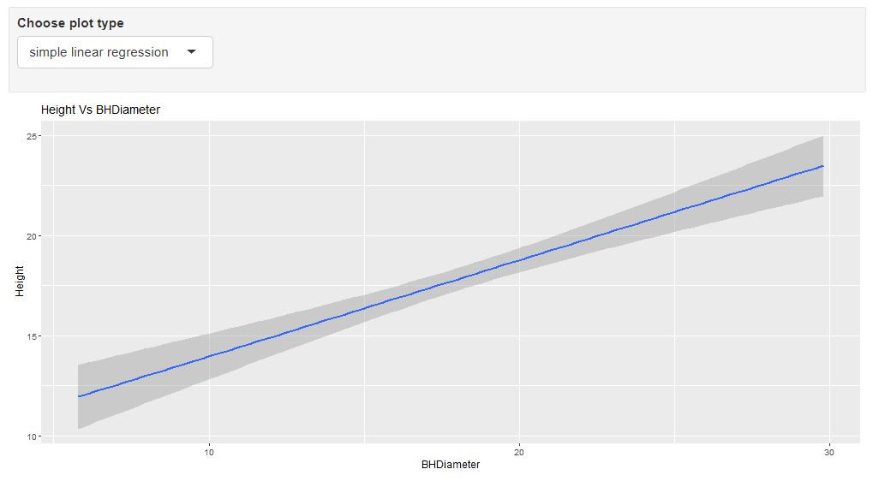
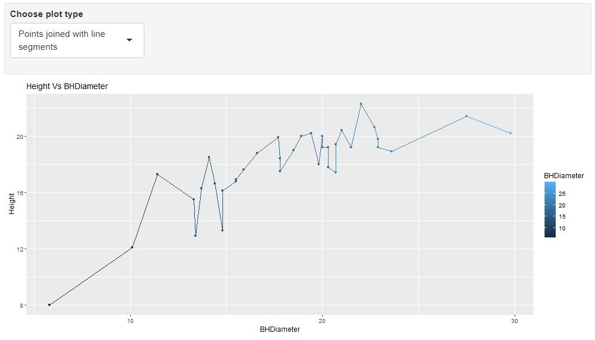

```{r setup, include=FALSE}
knitr::opts_chunk$set(echo = TRUE)
```

# Task 1

WD

```{r}
getwd()
```

# Task 2

```{r}
spruce.df = read.csv("SPRUCE.csv")
head(spruce.df)
```
3


# Task 3
```{r}
obj = lm(Height~BHDiameter, data = spruce.df)
summary(obj)
plot(Height~BHDiameter,bg ="blue",pch=21,cex=1.2,ylim=c(0,1.1*max(Height)),xlim=c(0,1.1*max(BHDiameter)),main="Spruce Heigth Prediction", data = spruce.df)
library(s20x)
layout(matrix(1:3,nr=3,nc=1,byrow=FALSE))
trendscatter(Height~BHDiameter,f=0.5, data=spruce.df)
trendscatter(Height~BHDiameter,f=0.6, data=spruce.df)
trendscatter(Height~BHDiameter,f=0.7, data=spruce.df)
spruce.lm = lm(Height~BHDiameter,data = spruce.df)
layout(matrix(1:1,nr=1,nc=1,byrow=FALSE))
plot(Height~BHDiameter,bg ="blue",pch=21,cex=1.2,ylim=c(0,1.1*max(Height)),xlim=c(0,1.1*max(BHDiameter)),main="Spruce Heigth Prediction", data = spruce.df)
abline(obj)
```
So, if we inspect the relationship between the smooth scatter plot and the normal scatter plot with the included least square regression we can see that the smooth scatter plot have a better correlation with the data points. neverthless, the linear regression is still accurate to some extend. i believe that to be able to validate the linear regression line more data points would be needed. so i will say that is more appropriated to use a non-linear model. 

# Lab 4

```{r}
library(s20x)
layout(matrix(1:4,nr=2,nc=2,byrow=TRUE))
layout.show(4)
plot(Height~BHDiameter,bg ="blue",pch=21,cex=1.2,ylim=c(0,1.1*max(Height)),xlim=c(0,1.1*max(BHDiameter)),main="Spruce Heigth vs BHDiameter", data = spruce.df)
abline(obj)

plot(Height~BHDiameter,bg ="blue",pch=21,cex=1.2,ylim=c(0,1.1*max(Height)),xlim=c(0,1.1*max(BHDiameter)),main="RSS", data = spruce.df)
abline(obj)
spruce.lm = lm(Height~BHDiameter,data = spruce.df)
yhat=with(spruce.df,predict(spruce.lm,data.frame(BHDiameter)))
with(spruce.df,{
segments(BHDiameter,Height,BHDiameter,yhat)
})
abline(spruce.lm)

RSS=with(spruce.df,sum((Height-yhat)^2))

RSS

plot(Height~BHDiameter,bg ="blue",pch=21,cex=1.2,ylim=c(0,1.1*max(Height)),xlim=c(0,1.1*max(BHDiameter)),main="MSS", data = spruce.df)

with(spruce.df, abline(h=mean(Height)))
abline(spruce.lm)

with(spruce.df, segments(BHDiameter,mean(Height),BHDiameter,yhat,col="Red"))
MSS=with(spruce.df,sum((yhat-mean(Height))^2))
MSS

plot(Height~BHDiameter,bg ="blue",pch=21,cex=1.2,ylim=c(0,1.1*max(Height)),xlim=c(0,1.1*max(BHDiameter)),main="TSS", data = spruce.df)
with(spruce.df,abline(h=mean(Height)))
with(spruce.df, segments(BHDiameter,Height,BHDiameter,mean(Height),col="Green"))
TSS=with(spruce.df,sum((Height-mean(Height))^2))
TSS
RSS + MSS
MSS/TSS
```
the value of $\frac{MSS}{TSS}$ indicates how well this trendline defines the data set and in this case it is around 0.65 which mean that this trendline does not predict reliabily the heigth of the trees

Yes $TSS = MSS+RSS$

# Task 5
```{r}
spruce.lm = lm(Height~BHDiameter, data = spruce.df)
summary(spruce.lm)
coef(spruce.lm)
predict(spruce.lm, data.frame(BHDiameter=c(15,18,20)))
```
Value of Slope: 0.4814743

Value of Intercept: 9.1468390

Equation of Fitted Line: Height = BHDiameter*0.4814743+9.1468390

at 15 cm Height = 16.36895

at 18 cm Height = 17.81338

at 120 cm Height = 18.77632

# task 6

```{r}
library(ggplot2)
g=ggplot(spruce.df, aes(x=BHDiameter,y=Height,colour=BHDiameter))
g=g+geom_point() + geom_line()+ geom_smooth(method="lm")
g+ggtitle("Height Vs BHDiameter",)
```

# Task 7
This is how you place images in RMD documents

<center>
{ width=70% }
{ width=70% }
{ width=70% }

</center>


